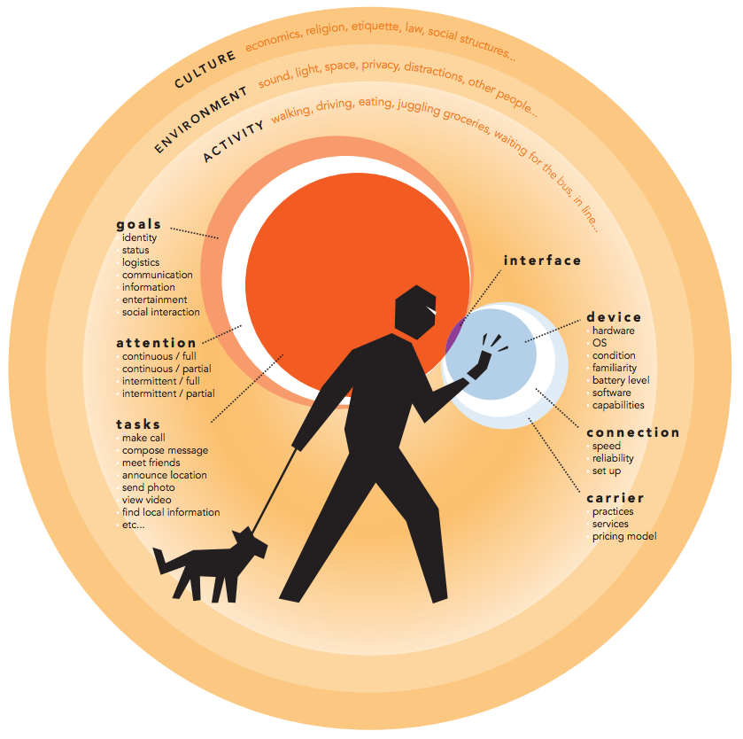

#Responsive Web Design

Images from http://bradfrostweb.com/blog/web/responsive-web-design-missing-the-point.

http://bradfrostweb.com is an excellent resource.

How wide is the browser you are using right now?
1024 pixels? 1280 pixels? These are typical of older laptops.

1920 pixels? That's a wide-screen LCD.

320 pixels? Many phones are this width.

As a web designer, you have no idea what kind or size of browser your site visitor will be using. And, it's just going to get more complicated.

What do you do?

You prepare your site to adapt to different browsers using "<strong>responsive design.</strong>"

If you don't apply any CSS styles to a page, the browser's built-in stylesheet is already responsive - all of the block elements are displayed a hundred percent wide. It's fills the screen on any width browser, desktop or mobile. When you start to add your own style sheets using CSS, you have to make choices about whether your design will be one size (fixed width layouts) or whether it will adapt to different widths (flexible and fluid layouts).

Up until the last few years, many web designers used fixed width layout designs. Frankly, they are easier to make. The template file is fixed-width. No matter what size the browser is, the web page is always the same width (in this case 960 pixels). This works ok in most browsers on big screens, because if the screen is wider than the page, people can zoom in to make the page larger. However, it fails utterly on smaller screens, like mobile browsers on tablets and phones.

#Goals and needs of the mobile user

Luke Wroblewski, a <a href="http://www.lukew.com/ff/entry.asp?933" target="_blank">noted web designer</a>, refers to the mobile user as &ldquo;one eye and one thumb.&rdquo; &nbsp;This means, first, that the mobile user is paying even less attention to your website in an environment that already demands their attention. This means you have to get their attention by offering them the most important information without fill or distraction. Second, it means that the display is much smaller (to fit the device) and the controls must be larger (to fit the size of your finger), requiring interactions to be much simpler.

The context, or environment for a mobile user is much more complicated than what a desktop user inhabits:

From:&nbsp;<a href="http://www.giantant.com/output/mobile_context_model.pdf" target="_self">http://www.giantant.com/output/mobile_context_model.pdf</a>

How to help your user's cope? In general, you need to <strong>simplify your layout and focus your content</strong> on only the essentials. Remove everything else.  As Jakob Nielsen says, "<a href="http://www.nngroup.com/articles/condense-mobile-content/" target="_blank" style="line-height: 16pt; text-indent: 0pt; font-size: 11pt;">Mobile Content: If In Doubt, Leave it Out.</a>"

You need a different layout and simplified content for mobile users. How to accomplish this?

# Mobile options

You have three options:

0. Mobile application (written in the device native language, downloaded to the device via an app store)
0. Separate web site optimized entirely for mobile devices
0. Responsive web site that changes appearance and content depending on the device

<strong>Mobile applications</strong> have the advantage that they can access the entire set of device capabilities. They can use the camera, gyroscope, accelerometer, GPS, and everything else. On the other hand, application development requires knowledge of specific programming languages, either Java, or Objective-C. &nbsp;For businesses, application development can be expensive. Finally, it is difficult to link to an application using a URL, making hard to incorporate a mobile app into a coordinated online strategy.

<strong>Separate mobile websites,</strong> optimized for small devices, pose a problem of maintaining two websites for the same audience and with the same content. It increases the amount of work.

<strong>Responsive websites</strong> allow you to create the content once and use it for both mobile and desktop websites. True, some of your content may be discarded for the mobile version, but at least you don't have to create, store, and manage the mobile content separately and in addition to the same content for desktop websites.

#Responsive design examples

To see and experience a variety of responsive designes, go to http://mediaqueri.es/ 

Click on one of the sites. Resize your browser by grabbing the lower right corner and dragging it left and right. Notice how the styles and page layout changes as the browser width changes.

For example, try http://www.time.com/time/ . Notice how images scale, the number of columns change, and the fonts adjust as the window gets smaller. 

#Fluid width layout

In this first responsive design module, we'll talk about how to define width, margin, and padding so that the layout stays the same proportionally as the browser width changes. 

The page structure looks like this:

    
 <!-- contains everything on the page; used for centering and margins-->
      
 <!-- contains the constant stuff at the top of the page -->    
      
    
      
 <!-- one article per week -->    
        
    
        
    
        
    
        
 
      
 <!-- .article -->    
      
 <!-- copyright information -->    
      
    
    
 <!-- .container -->    

In the first, fixed layout case, we use pixel measurements for widths, margin and padding:

    .container {    
      width: 900px;   
      margin-left: auto;    
      margin-right: auto;    
    }    

    .article {    
      margin: 20px;    
    }    

    .article_heading {    
      width: 600px;   
      margin-left: 20px;    
      padding: 10px;    
      border: 1px solid black;    
    }    

    .article_content {    
      margin: 0 20px0 20px;    
      padding: 10px;    
      border: 1px solid gray;    
    }    

In the second, fluid layout case, we use measurements that are a percentage of the parent element for widths, margin and padding:

    .container {    
      width: 90%;    
      margin-left: auto;    
      margin-right: auto;    
    }    

    .header {    
      margin: 5%;    
    }    

    .article {    
      margin: 5%;    
    }    

    .article_heading {    
      width: 70%;    
      margin-left: 5%;    
      padding: 2%;    
      border: 1px solid black;    
    }    

    .article_content {    
     margin: 0 5%;    
     padding: 2%;    
     border: 1px solid gray;    
    }    

Notice a few things:

0. I'm not directly converting the pixels to percentages. There is a method for calculating this, but in this module I'm just choosing new values for the percentages that are similar.
0. I'm still using pixels when defining borders.
0. There are other measurements in the stylesheet that have to change in addition to the ones shown in this example.

# Media queries

So, how do we change the styles, layout, and elements on the page to adapt to the mobile screen and mobile user experience?

HTML and CSS provide a mechanism for detecting (or "querying") what kind of media you are talking to and what its features are. This mechanism is called media queries.

## Media types

Browsers come in different<strong> media types</strong>. Examples include:

0. <strong>screen</strong> - a laptop, desktop, mobile, or other device that can display web pages on a screen
0. <strong>print</strong> - a printer
0. <strong>speech</strong> - a web browser that parses the HTML and speaks to the user, reading the web page

There are others. See <a href="http://www.w3.org/TR/CSS2/media.html">http://www.w3.org/TR/CSS2/media.html</a>

## Media features

Each type of media has characteristics that it can report to help your web page decide how best to present your information. Examples include:

0. <strong>width</strong> &lt;integer&gt; (pixels)
0. <strong>height</strong> &lt;integer&gt; (pixels)
0. <strong>orientation</strong> (portrait|landscape)
0. <strong>color</strong> &lt;integer&gt; (0=mono)
0. <strong>resolution</strong> &lt;integer&gt; (dpi)

For more information, see&nbsp;<a href="http://www.w3.org/TR/css3-mediaqueries/" style="line-height: 16pt; text-indent: 0pt; font-size: 11pt;">http://www.w3.org/TR/css3-mediaqueries/</a>

## How to write media queries

A<strong> media query</strong> is a way for your web page to ask the browser what kind of media type and which media features are available. A media query can either be in your HTML code, or in your CSS stylesheet. Let's see some examples.

### In the link tag in the HTML

In your HTML file, you can have multiple link tags, one for each kind of media. &nbsp;The browser decides &nbsp;which stylesheet to use based on the media type. &nbsp;in the <strong>link</strong> tag, use the <strong>media</strong> attribute to specify the media type. &nbsp;Examples:

    <link rel="stylesheet" type="text/css" <strong>media="screen"</strong> href="sans-serif.css">
    <link rel="stylesheet" type="text/css" <strong>media="print"</strong> href="serif.css">

### In the CSS style sheet

In your CSS stylesheet, you can choose to import a style sheet file based on the media type and features. &nbsp;In the following example, a stylesheet is imported when the media type is a color screen:

    @import url(/style.css) screen and (color);

This can be useful in complicated websites with many files and pages, allowing reuse of media-specific rules among different stylesheets.

Finally, inside a single stylesheet, you can specify style rules based on media type and features using the @media command.

The general form of a media query is:

    @media [not|only] type [and] (expr) { 
      rules
    }

A media query has four basic components:

0. Media type: specify the type of device to target
0. Media expressions: test against a feature and evaluate to either true or false
0. Logical keywords: keywords (such as and, or, not, or only) that let you create more complex expressions
0. Rules: basic styles that adjust the display

(from <a href="http://www.worldcat.org/title/implementing-responsive-design-building-sites-for-an-anywhere-everywhere-web/oclc/809169765&amp;referer=brief_results" target="_blank">Implementing Responsive Design: Building Sites For An Anywhere, Everywhere Web, Tim Kadlec, New Riders, 2013</a>)

For example, if you wanted the font to turn blue when the screen width got below 320 pixels, you would use the media query:

    @media only screen and (max-width: 320px) { 
      a {
        color: blue;
      }
    }

Or, if you wanted to stop displaying all &lt;div&gt; regions of the class "desktop-only" when viewed on a small screen:

    @media only screen and (max-width: 320px) { 
      .desktop-only {
        display:none;
      }
    }

# Lab

<strong>This module introduces responsive design techniques.</strong> In this assignment, you make some changes to a journal file styles to make the layout more flexible. Then, you make some more changes to make it respond and actually change layouts depending on browser width. In the end, the file will be viewable on mobile phones as well as desktops.

You copy the template folder to a "site" folder, rename the files make some changes to the template stylesheet to make your web page respond to changes in browsers

Your client has come to you and said, "Make the design fluid. Further, for very small mobile browsers, make the layout simpler by removing a bunch of those borders and colors. Make the content more focused by getting rid of those validation badges - the user doesn't want to deal with them while they are browsing." She further specifies that what she considers to be a "very small mobile browser" is anything less than 501 pixels wide.

## Instructions

### File preparations</h3>

0. Make a copy of your template folder and rename it to "site"
0. Copy your CSS file (in your stylesheet folder) to a new file.  
0. Change the stylesheet link in your file to use the new stylesheet

### Fluid width changes
0. Modify your stylesheet to use <em>percentage</em> units of measure instead of <em>pixel</em> units of measure for width, padding and margin. Leave all the zero values alone (zero values do not take units of measure). Do not add width rules to any element that does not already have widths specified. Unspecified element are fluid by default.

0. Make all widths (including the main container, header and footer, and various article, article_heading and article_content divs widths)<strong> 90%</strong>

0. Make all the non-zero margins <strong>5%</strong>&nbsp;
0. Make all non-zero padding <strong>2%</strong>
0. Leave any height measurements as pixels.

0. Test your changes by making your web browser first wide and then narrow. Make sure that all elements flex with browser width.

### Media query changes.

In the following sequence, the instructions start out very explicit and gradually become simpler (and you have to figure out what style rules to use).

0. Modify your stylesheet to use a media query at the very bottom of the file. You put it at the bottom of the file so that it overrides the previous rules.

<strong>Remember - your desktop version of the file must appear the same as it always has - validation badges present, colors the same. The following changes should only become apparent when the browser becomes narrower than 500 pixels.</strong>

0. Make the media query detect screens whose maximum width is 500 pixels. A query like

    @media (max-width: 500px)

should work.

0. Make the validation badges disappear for small screens. You can set the property "display: none;" for their div (look for &lt;div class="validation_badge"&gt; in the HTML to find them).&nbsp;
0. Make the overall "container" div have the following properties for small screens: 100% width, background-color: white, and margin: 0. This will remove borders and make the background color "cleaner."
0. Make the "article_heading" div "cleaner" by removing the border and setting the background color to white.
0. Test your changes by making your web browser wide and narrow.  It should look something like the following video:

<iframe width="560" height="315" src="http://www.youtube.com/embed/TSEMbyJs1Ds?rel=0&amp;wmode=opaque" frameborder="0" allowfullscreen=""></iframe>

