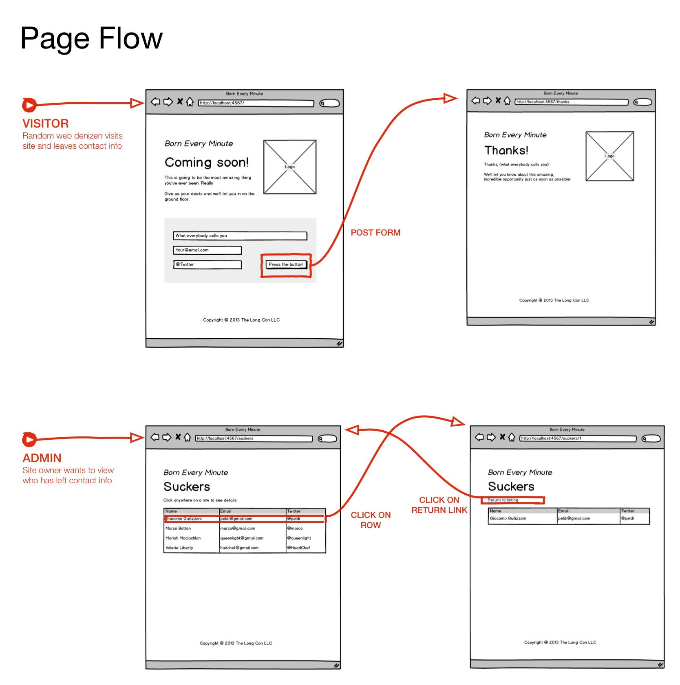

*Portland Code School*
#Ruby Code Challenge 3

## Overview

This code challenge has you build our first web application, using a gem called, "sinatra".

You are on a design team with your PCS partner, me (as customer advocate), a front-end designer named Frank "Front-End" Stein and a technical lead, Emily "Engineering" Smith.

Your specification for this code challenge takes the form of several emails from your project team. Read through them carefully and try and understand what you need to build.

Build your project in several iterations, as described by Emily. The first few iterations are guided and simple; the later iterations require more digging on your part. For each iteration, commit and *tag* your files for later. As before, you may be called upon to revert your repository and demonstrate your code and tests for an earlier iteration. 

Everybody should do be able to get through all of the iterations. See below for how to adapt the challenge requirements to your skill level. Get as far as you can. *Do not get stuck*. In the last code challenge, I noticed teams spending time pondering and wondering. This time, if you have a question, give it your best shot, do your homework, and, if you are still stuck, ask me or another team. Even if you are relatively inexperienced, you should be able to do *something* in each iteration.

**Note: Whatever code you write must adhere to [this style guide](https://github.com/bbatsov/ruby-style-guide) so use [the checker that goes with it](https://github.com/bbatsov/rubocop) as you code.  You must check your code as part of your commit process and either fix all problems or clear your exceptions with me before proceeding. You will have to document your exceptions in your code as comments.**

## Deadline
Your deadline for the code challenge is next Wednesday at 6pm. We will start the code walkthroughs right after warmup. You can send me email and I'll look at your github repo if you need advice, or come to the hack sessions and we can talk about it.

## Difficulty levels

I want you to take a different approach to adjusting the difficulty of the assignment to match your current skill level. I want everybody to set themselves the goal of completing all iterations. However, I want you to adjust how you complete the iterations to match your abilities.

#### Easy

If you feel you are operating at the "easy" level, do just what is necessary to achieve the functionality for each iteration.  You do not necessarily have to achieve the look and feel that the client requested, and you may not be able to achieve good code coverage or adhere to the principles of "test-driven design". If you can't get all the functionality for a particular iteration, check in with your "customer advocate" (me). You may be able to get a waiver and move to the next iteration.

#### Medium

If you are operating at the "medium" level, you must complete all of the functionality requirements, you must achieve the exact look and feel requested by the client, and you should do your best to adhere to the principles of "test-driven design". If you cannot figure out how to write the test for a particular function, again, check in with your "customer advocate" (me). You may be able to get a waiver and revert to "code-first" methods. Some things may not be testable, at least with MiniTest.

#### Hard

If you are operating at the "hard" level, you must be complete on functionality and look & feel.  You must adhere to TDD principles. You should achieve as close to 100% code coverage as possible, even if this requires finding and using additional testing tools besides MiniTest.  Finally, near the end, there is a request to gather performance data comparing two iterations of the design using a large set of dummy data. At the hard level, you should be able to present the data you gather and describe your conclusions comparing the two alternatives to the class.

## What, this is a spec?

### Iteration 1

--------
**To: Design Team**

**From: Emily**

**Subject: Getting started on the "Born Every Minute" account**

People,

While Frank is working with the client to nail down the look and feel, wireframes, and page flow, I think we can get started with the Sinatra framework. Here's what I'd like to see for iteration one:

0. Get Sinatra installed on your systems, review the materials on HTTP and other topics that you've got, and, in general get your development environment synchronized with your pair programming partner.

0. Create a repository in your personal gift hub account and have both you and your partner use it during development. We'll clone the repo later into the company account.

0. Check out this gist (https://gist.github.com/Auraelius/7126869):

0. Use the gist for your first test. Don't forget the test_helper.rb file and make sure you use a "test" folder to hold your tests.

0. Use the gist as a starting framework for your Sinatra app to make the app pass its first tests. You will have to fill in the code, these are just some routes. As you can see, we will be using the "classic" form of Sinatra, not the "modular" form. Let's keep things simple.

0. Don't worry about stylesheets yet, we will deal with those later.

Hopefully, by the time you've got that up and running, Frank will be back with the details on what the client wants.

I'm excited to get this project started!

Emms

### Iteration 2

--------
**To: Design Team**

**From: Frank**

**Subject: Finally, the client has made some decisions.**

I mean, honestly! Some people never make up their minds!

Here are the wireframes and page flow diagram for the "born every minute" account. I know there isn't enough information here to finish, but just getting this far was like pulling teeth! Chicken teeth! And I know you guys of been waiting, so here it is.

First, what we don't know. Just help me out and fill in these details until I get you more information.

0. The client hasn't decided on a logo. However, it it's important that we put some sort of image on the pages. Please find an image somewhere (and watch those licenses, please!). If you can make it work on the concept of "trustworthiness" and "excitement", that would be even better. These are the clients keywords. You'll notice that the logo has to appear on every page visible to the customer.

0. The client hasn't finalized the color palette yet, so please just give us some styles that match the following criteria:

    0. Warm cream colored background. No tighty whities, please!
    0. No black fonts! Give me a charcoal but make it readable.
    0. Pick a sans serif font. I'll get you the exact web fonts and font stack later.
    0. You'll notice that the form has a background color. We need a shade of green that reinforces the "trustworthiness" concept but keep it light, people! And no rounded corners! That is so 2010. Keep it flat, but if you want to drop shadow, I guess I can live with that.

Okay, here's the wireframes. Be sure to check out the URLs in the title bar.

Visitors arrive at this page.

When they fill out the form and click submit, they end up at this page.  N-otice that we use the form data to craft our welcoming and reinforcing message to the sucker, I mean customer. (That's what comes from spending too much time with the client.)

The client wants an admin interface. Don't worry about authentication at this point, just create a unique URL, as shown in the wireframe. When they hit this URL, they want a list of everybody who has responded to the form:

When they click on one of the respondents, anywhere in the row of the table, they want to go to a page that shows the detail for that particular customer. That page has a link to return to the base of the admin pages. The detail page looks like this:

Finally, here's a page flow diagram that summarizes what I've got so far.

I'll get you more information as soon as I know it. Clients: can't live with them, can't shoot them.

Ciao Bella!

Frankie

--------
**To: Design Team**

**From: Emily**

**Subject: Setting up a project structure and getting started.**

Okay, I'm assuming you've heard from Frank by now. In iteration 2, I'd like us to achieve the next set of functionality:

0. Set up a folder structure that uses the built-in Sinatra assumptions.

0. Make sure to include an assets folder for the stylesheet. Keep the stylesheet simple, but see what we can do about producing what Frank is able to tell us. Each of you can pick a different logo file, just name it the same.

0. Set up a standard layout that includes the header and footer that appears on every page. Use partials if you like, but this isn't a hard requirement.

0. Use external template files and the ERB templating language.

0. All code needs to pass the style checker. I don't want any more arguments about spaces at team meetings. All exceptions have to be cleared through me or the customer advocate.

0. Don't worry about storing the form data in any persistent manner yet. Every time they submit a form, you can just use the same variables over. We're still working on our database back end strategy. For now, just make sure that the form data is used in the thank you page as Frank describes. In fact, in the development environment, you can print out all of the form data, the programs data structure, and even the whole request data structure if you like. Just make sure it doesn't show up in the production environment.

0. In the admin page, your table can include just one row, but implement the details page right away.

That's it for this iteration. Let me know if there's any problems.  Be sure to talk to the team if you get stuck and talk to the customer advocate if you're just having any problems with one of the features.

I'm glad this is underway.

Emms

### Iteration 3 - In-Memory data storage of multiple respondents

--------
**To: Design Team**

**From: Emily**

**Subject: Data back-end update**

I was hoping to have a better solution at this point and to be able to give you good news, but we're still in discussions on the database side of things. However, we're coming up on a big client demo so we need to be able to make it look like the app can store more than one respondent. (Even if all of them are lost when we turn off the app. Hey, all early demos are smoke and mirrors, right?)

So, here's what I'd like you to do for this iteration:

0. Use an in-memory data structure to store all of the respondent data.  Use an array of hashes if you like. That seems to be the simplest thing I can think of but you may have a better idea.

0. Every time the form is submitted, append the new information to the data structure. On the admin page, display the entire data structure and provide click-through to the respondent detail page.

0. Make sure your tests verify that you can store multiple respondents reliably.

I'll try to get you some closure on the database issue soon. Last I heard, management in San Francisco had hired some industry guru who has supposedly "Solved the whole SQL vs. NoSQL brouhaha". I'll believe it when I see it.

Did I tell you I love working with you people?

Emms

### Iteration 4 - File-based persistent storage

--------
**To: Design Team**

**From: Frank**

**Subject: Thanks, Team**

The client loved the demo! Kudos to all of you! You are absolutely fabulous! Happy hour Friday is on me!

After the demo, the client finally specified how they want to be able to get at the data. Get this – they want to use a spreadsheet. They want the list of respondent data to be available in something called a "comma-separated-value (CSV??)" file. They want to be able to open the file in a spreadsheet as well as be able to get to the information through the administrative interface.

At least, I think this is the requirement. By this time, we'd had a snootful of single malts at the after-demo party.  I'm sure all you technical people know what a CSV file is but frankly, I'm in over my head.

Have I told you lately that you're absolutely fabulous?

Ciao Bella!

Frankie.

--------
**To: Design Team**

**From: Emily**

**Subject: Data back-end update - part 2 - the Embiggening**

Well, as you all know, our so-called guru was in town last night and, in between beers, our new system architect Christophe set our architecture back several centuries.

We are going to use a file-based persistent data storage method. That's right, a file. I don't believe it either. Christophe says it's the easiest way to meet the client's CSV file requirement. Apparently, he's never heard of exporting data from the database.

In any case, please implement the following in this iteration while I talk to management.

0. Make sure you create a good, strong baseline with working code and an accurate tag for the previous iteration. We may end up going back to it. I know you all do this anyway, but this time I want you to make sure.

0. Replace your in-memory data structure from the previous iteration with a file-based data structure. That's right, your eyes are not deceiving you.

0. Use CSV file format and use the CSV library to interact with the file. No reinventing the wheel here, folks.

0. Every time you get new form data, appended the data to the file. 

0. Be sure to create the file the first time you get a response and make sure your display page works if there's no file. 

0. Close the file in between every access.

0. When you display the list of respondents, read in the file and display its contents in the table.

0. When you display the details for a particular respondent, open the file again, search through it until you find the record, and then display the record.

0.  Make sure your tests verify that the file is being written with correct information and that information is being read from the file and displayed correctly.

I know this sounds crazy. Just implement this for me please. And you over-achievers: *Don't* cache the file data as you bring it in off of disk. Just go straight to disk and back. I have my reasons. 

Trust me.

Emms

### Iteration 5 - How slow is it?

--------
**To: Design Team**

**From: Frank**

**Subject: OMG! The client is *Pissed!* **

What did you people do? The last demo went *horribly* wrong. The site is as slow as polar bear snot in a snowstorm! The client is furious!

I am *NOT* going to lose my commission! Management is going to hear about this. 

How could you do this to me? Forget about Friday Happy Hour. I have plans.

Frankie.

--------
**To: Design Team**

**From: Emily**

**Subject: I need some data.**

Folks, don't worry. I'm making sure everybody knows this is my problem. You guys are untouchable. 

I need some data. In this iteration, would you do something for me?

0. Get ahold of the "faker" gem so we can generate a metric ton of data. (Get it? "Metric ton." You know, for generating metrics.)

0.  Use the faker gem to generate a CSV data file with at least a thousand entries in it but don't go crazy. 

0. You can generate the file in a command line script or, for grins, you can create a custom URL and generate it in the web app itself. Something like 

    http://localhost:4567/generate_dummy_data/ 

    I know this isn't valid rest syntax, being a verb and all, but it might in handy later.

0. Benchmark the performance of the admin display page when it is displaying the entire data set. If possible, write a test that gathers this data automatically. However, if you just use the Chrome developer tools to see how long it takes to load the page, that's will do.

0. Benchmark the performance of the respondent detail page when it has to display the details of the 500th respondent. Again, if you can write an automated test for this, please do.

0. Go back to that earlier iteration where we still used an in-memory data structure. (See? I told you we would need this.)

0. Branch your code at this point so we can make some modifications that will help with the benchmarking. Make sure you are working on the branch.

0. Add the routine that generates the dummy data. Make sure it's the same number of respondents as you used in the file-based example. Obviously, you'll have to generate this data using the web app itself because there's no files. Just make sure you get the same data as you did before.

0. Benchmark the performance of the admin display page when it is displaying the entire data set. If possible, use the same test that you used before so the test results are indisputable. However, if you could just use the Chrome developer tools again.

0. Benchmark the performance of the respondent detail page when it has to display the details of the 500th respondent.

Once we have this data, we can demonstrate where the slowness is coming from and, as an added bonus, we can help Christophe buy a vowel and learn why a database is a better idea.

Thanks for putting up with these shenanigans.

Emms

## Postscript

On Friday, there was a climactic, tension-filled executive meeting where Emily presented the data via Skype.

Christophe boldly took responsibility, which was a pleasant surprise to Emily. Emily's helpful suggestion that there are many databases that have already solved this performance and scalability problem, and any one of them could easily be implemented in about an hour, was ignored by everyone at the meeting when Christophe stood and said somewhat theatrically, "I'll handle this!" 

Management said, "You'd better!" and congratulated themselves on having hired a team that could solve such important if obscure technical issues.

Christophe implemented a hand-built, hybrid solution where he used the in-memory data structure as a cache for the CSV file data, developing this code by hand in a Mountain Dew and pizza-fueled coding frenzy weekend at the office and at great personal cost to his marriage. 

He was still coding Monday morning up to the moment of the final client demo. He crossed his fingers as the demo started because he hadn't written any tests and didn't *really* know if the app was going to work or not.

The client loved the app. Frankie got his commission. Christophe got a bonus and a promotion due to his, as management wrote on his award plaque, "Coolness under fire while going 'above and beyond' to solve an unexpected client crisis".

On Tuesday, Emily got a great job at Rails shop across town where, over the next few months, she hired the rest of the development team, one after another, at modest salary increases and significant hiring bonuses. 

Today, they have great fun discussing the intricacies of the SQL vs NoSQL design choice as they quickly crank out projects.

Copyright © 2013 Alan Zimmerman  
Used by permission by Portland Code School